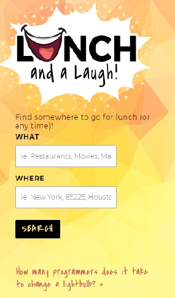
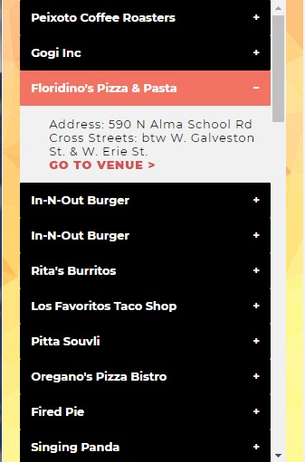

<h3>NAME:</h3> 
Lunch and a Laugh

LINK: https://lesleydreyer.github.io/LunchAndALaugh/

<h3>SCREENSHOTS:</h3> 

<h3>SUMMARY:</h3> 
A website where users can search for venues to visit at lunch (or any time) and also get random joke.

<h3>TECHNOLOGY:</h3>
HTML, CSS, JavaScript, jQuery, Foursquare API, and a Official Joke API from Todd Motto list of public APIs
